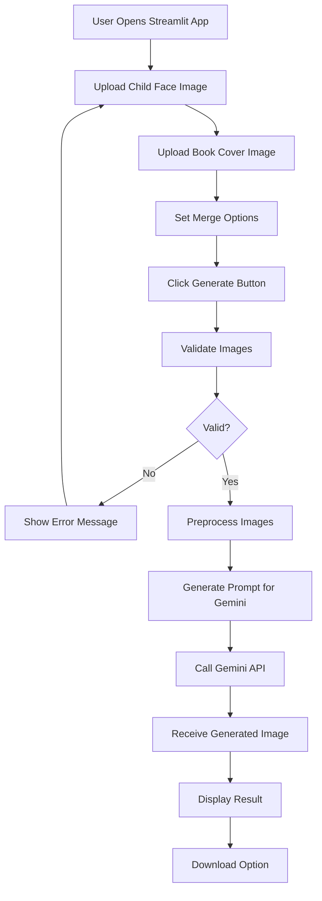
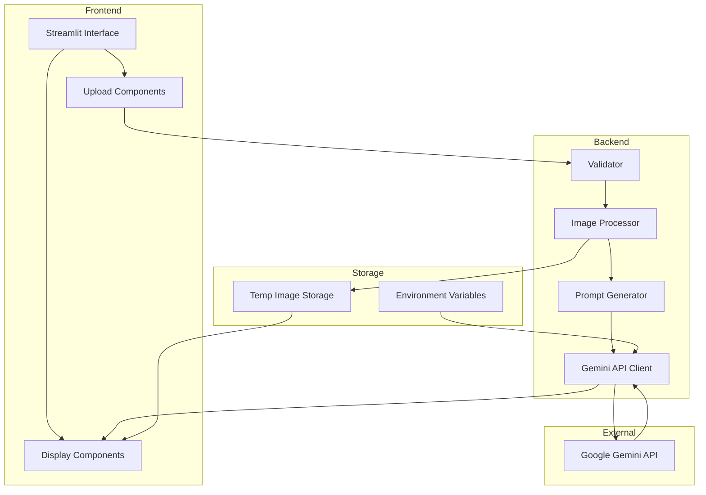

# AI Book Cover Face Merger - Architecture Overview

## Application Workflow

## System Architecture

## Key Components

### 1. **Streamlit Interface**
- Dual file uploaders for face and book cover
- Preview panels for uploaded images
- Options panel for merge settings
- Result display with download button

### 2. **Image Processing Module**
- Format conversion (JPEG, PNG support)
- Image resizing for API optimization
- Base64 encoding for API transmission

### 3. **Gemini Integration**
- API client with retry logic
- Dynamic prompt generation
- Response handling and error management

### 4. **Validation Layer**
- File type validation
- Size limit enforcement
- Image quality checks

## Technical Stack

- **Frontend**: Streamlit
- **AI Service**: Google Gemini API
- **Image Processing**: Pillow (PIL)
- **Environment Management**: python-dotenv
- **HTTP Client**: requests or google-generativeai

## API Integration Flow

1. User uploads two images
2. System validates and preprocesses images
3. Generates contextual prompt: "Merge this child's face naturally into this book cover, maintaining artistic style"
4. Sends request to Gemini with both images
5. Receives generated image
6. Displays result with download option

## Error Handling Strategy

- Invalid file formats → Clear error message with supported formats
- API failures → Retry mechanism with user feedback
- Large file sizes → Automatic compression or rejection with guidance
- Network issues → Timeout handling with retry option